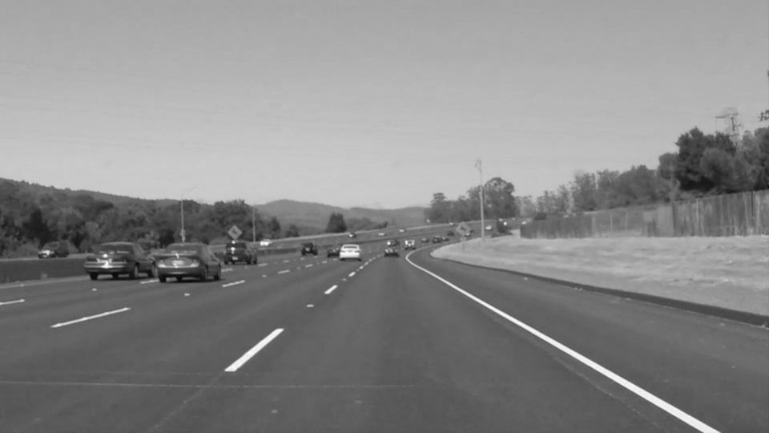
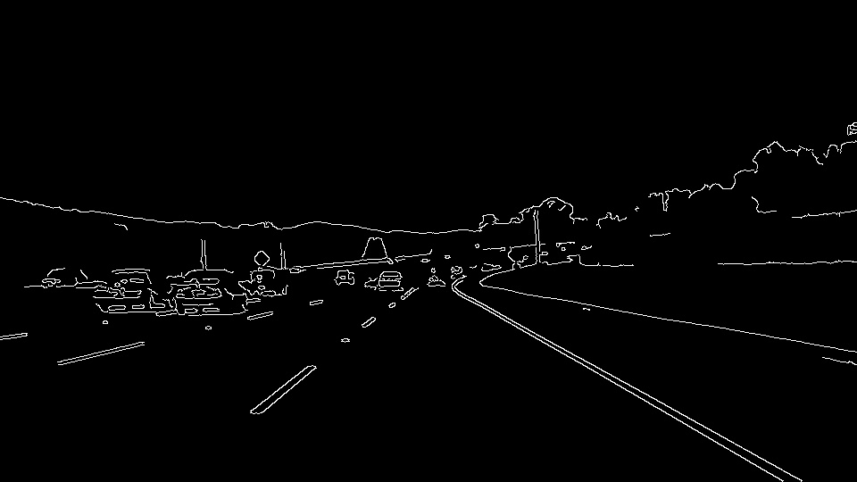
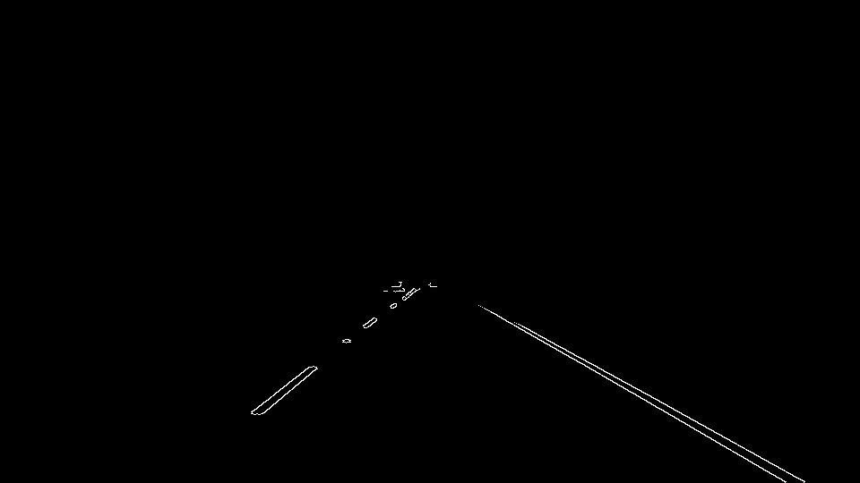
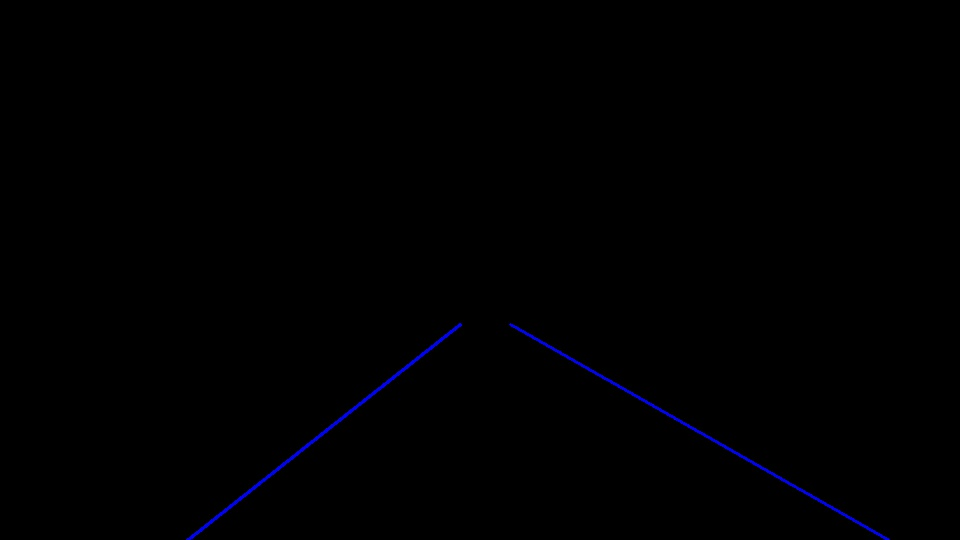
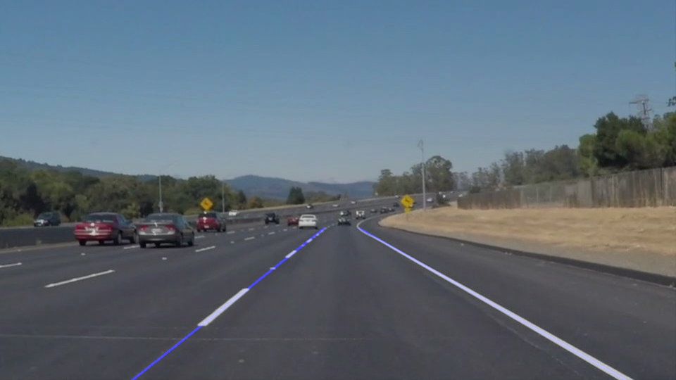

# **Finding Lane Lines on the Road** 

## Submitted by Jackson Isaac

---

**Finding Lane Lines on the Road**

The goals / steps of this project are the following:
* Make a pipeline that finds lane lines on the road
* Reflect on your work in a written report

[//]: # (Image References)

[image1]: ./examples/grayscale.jpg "Grayscale"

---

### Reflection

### 1. Describe your pipeline. As part of the description, explain how you modified the draw_lines() function.

Having already worked on some image processing projects myself, I started by exploring the image, it's shape and area of interest to extract. Before starting I went through the previous lessons and also the code provided in the notebook.

#### Initial exploration
My initial pipeline consiste of 6 steps in the following order:
1. Convert input image to grayscale
1. Filter Region of Interest (ROI).
1. Run canny edge detection on ROI.
1. De-noise image using Gaussian API
1. Perform Hough Transformation on de-noised image
1. Draw lines detected from hough transformation onto the input image.

First, I converted the image to grayscale, then extracted ROI from grayscaled image. 

After that I ran canny edge detection with different range to see how much information was retained and was the information useful i.e., lanes were retained or not, and what other edges were detected.

Then, I tried to remove noise from the cropped area, and ran Hough Transformation on the de-noised image. I noticed that the borders of the cropped image were also detected by canny and results were not proper.

To overcome this issue, I moved the ROI extraction after canny edge detection, and got the intended results.

#### Finalizing pipeline structure and parameter tuning

After my initial exploration and observations made in each step, I finalized the pipeline as follows:
1. Convert input image to grayscale

2. De-noise image using Gaussian API

3. Run canny edge detection on ROI.

4. Filter Region of Interest (ROI).

5. Perform Hough Transformation on de-noised image

6. Draw lines detected from hough transformation onto the input image.

Next step was to correctly identify and differentiate the left and right lanes, instead of just drawing lines over any line, which might seem like a lane, detected in the image.

For this, I started exploring the positional values i.e., (x, y) of the lines detected. I noticed that left lane had a negative slope, whereas right lane had a positive slope.

I made use of two lists, left_lane and right_lane, to store the (x, y) values of the lane in corresponding side i.e., left or right; by calculating the slope of each line.

Next task was to create a single left lane and single right lane. For this, I modified the draw_lines() function provided.

In some cases, the left lane had gaps between two lines, and in some right lane had gaps. If the vehicle is travelling in center lane, both the sides would have gaps. Some samples had yellow/white connected lane on left side and in some right side.

Inorder to generalize this, we need to have a single line for each lane. To compute the start and end of this lane, I made use of polynomial api available in numpy. To better understand this, I went through the 'Student Hub', where I found a [link](https://medium.com/@mrhwick/simple-lane-detection-with-opencv-bfeb6ae54ec0) explaining the lane detection using opencv, which I have referred and understood the logic behind it.

I used np.polyfit() which takes a polynomial of degree 'n', and return (x, y) point; which in turn is provided as a input to np.poly1d() which creates a polynomial equation from (x, y). In our case, we need to provide (y, x), since y is a coefficient variable and x is a constant value.

Using this, we get a equation like 'A = yB + x'. In order to create the lane, we pass the postional value of bottom of the image (y_max) and upto the middle horizon (y_min) until where the end of lane is visible, as per the camera alignment done in samples provided. Pixel position will be in reverse order since (0,0) starts from top left of the image.

For the challenge video, I noticed that the dimensions are different, so I updated the vertices to dynamically take (x, y) for extracting ROI accordingly.

Then I realized that in some frames, the lanes were too much inclined which caused the lane to jump off and was not stable. So I filtered out the lines where slope was > 0.5 in a frame. After filtering out the unstable lines, I was able to get a much better and stable output.

### 2. Identify potential shortcomings with your current pipeline

Some of the shortcomings that I thought of while working on the project are
- It might not work well when there is more traffic
- Cars crossing over lanes
- At intersections, turns and curves; the current pipeline might fail
- Missing/unmarked lanes ? In countries where lanes are not marked at all or are missing.

### 3. Suggest possible improvements to your pipeline

Some possible improvements that can be done are as follows
- Fine tune the parameter to suit the different scenarios. Currently the parameters are tuned to the given set of inputs.
- For different scenarios like highway, city, intersection, traffic, and other such scenarios; we can have different set of pipelines which would work in harmony and accordingly update the lane detection and conveying the corresponding lane information.